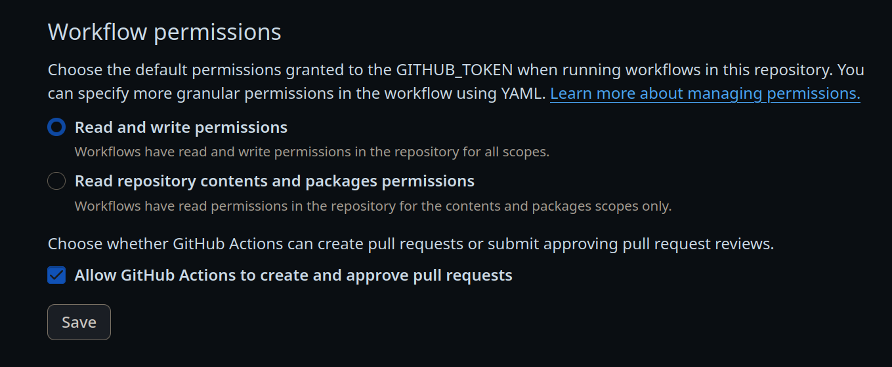
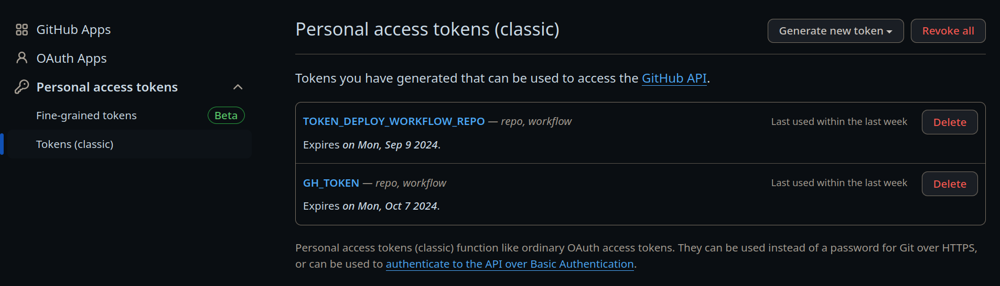
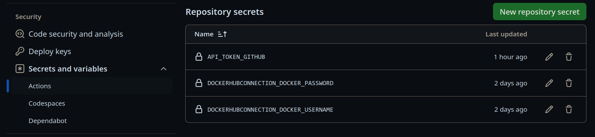

# workflow-react-example

## How to configure

    1. Set up GitHub Actions workflow permissions:

    Go to repo settings -> Actions -> General -> Workflow Permissions:



    2. Create a Personal Access Token:

    Go to your GitHub profile -> Settings -> Developer settings -> Personal access tokens -> Tokens(classic):



    3. Create a repository secret:

    Go to repo settings -> Secrets and variables -> Actions -> Repository Secrets:



All the Kubernetes manifests are here: https://github.com/ahioros/deploy-workflow-react-example

## More information

https://ahioros.info

https://www.ahioros.info/search/label/DevOps


# The React-App rdiCidr

Ok, let's get this out of the way. Why did I choose that name? I chose the name because palindromes are fun. The app's name stands for RDerik's Interactive  CIDR (RDICIDR). I had to add the Interactive to make the name work. I hope you like it.

RDICIDR is a react-app, but if you want to focus on the subnetting code, check the file:

```
src/lib/ipv4.js
```

You should find there how each property was calculated.

This application is not a final product. I just built it because I wanted to refresh my subnetting knowledge. Enjoy!

# Live version

You can find a live version at the following url:

[https://rdicidr.rderik.com](https://rdicidr.rderik.com)

If you find this tool useful, you might enjoy reading my blog: [https://rderik.com](https://rderik.com)
